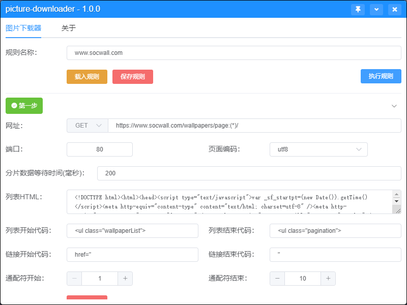
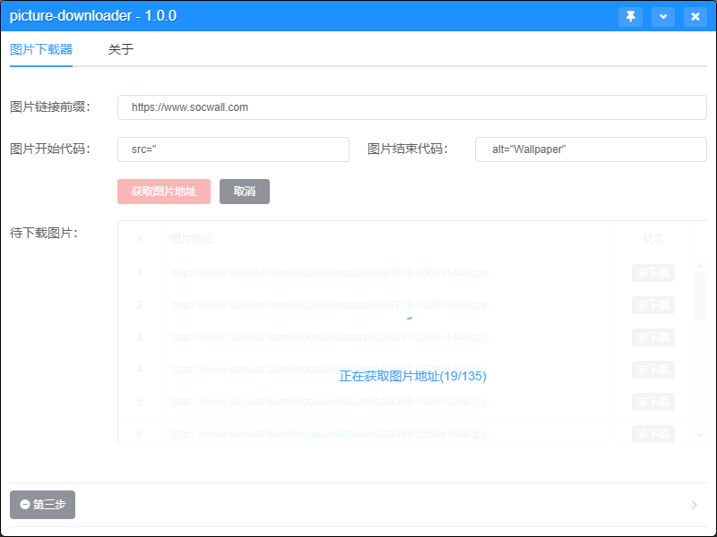
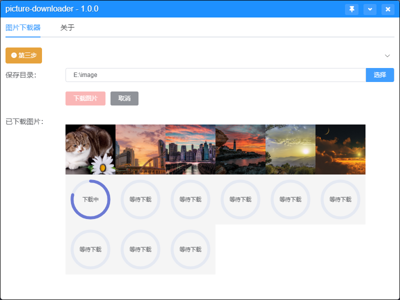
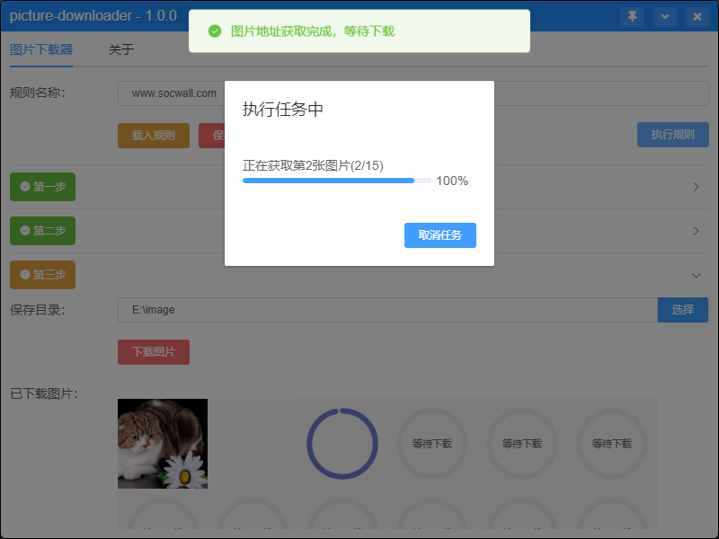

# picture-downloader

图片下载器

- 设置图片下载规则自动完成下载
- 下载规则可生成文件，便于分享
- 使用nodejs + vue开发

预览









## 安装
```
npm i
```

### 开发
```
npm run dev
npm run start
```

### 打包成EXE文件 放在 ./pack 目录下
```
npm run pack
```
